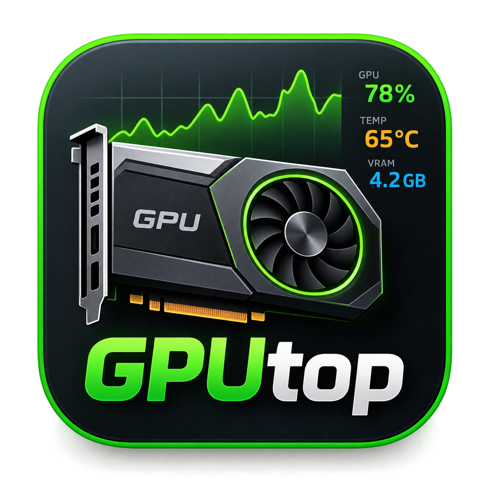
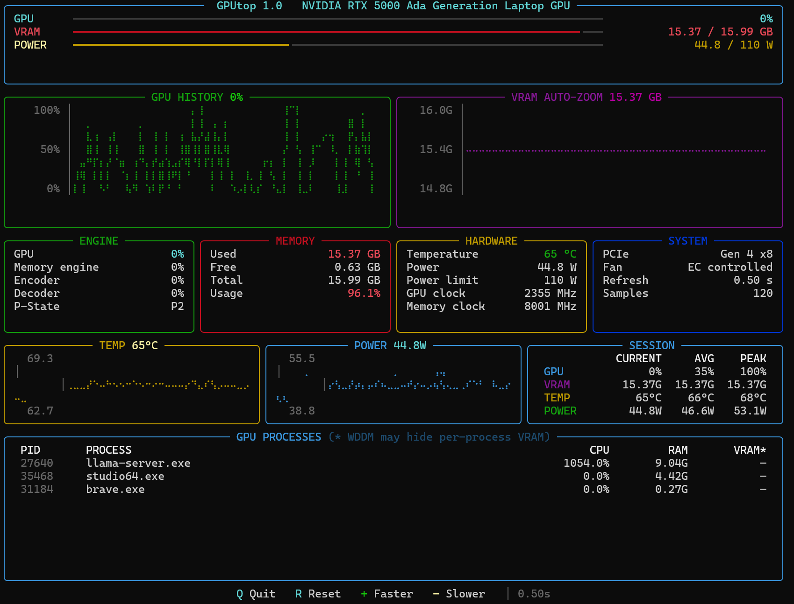

<p align="center">
  
</p>

<h1 align="center">GPUtop</h1>

<p align="center">
  A lightweight, btop-inspired real-time NVIDIA GPU monitor for Windows.
</p>

<p align="center">
  <a href="https://github.com/nabilsellamiAi/GPUtop/releases/download/v1.0.0/GPUtop.exe"><strong>Download GPUtop.exe</strong></a>
  &nbsp;•&nbsp;
  <a href="https://github.com/nabilsellamiAi/GPUtop/releases/tag/v1.0.0">v1.0.0 Release</a>
</p>



GPUtop provides a compact terminal dashboard for monitoring GPU load, VRAM usage, temperature, power, clocks, PCIe status, GPU processes, and session statistics.

## Features

- Real-time GPU utilization
- VRAM usage and history
- GPU utilization history graph
- Temperature and power monitoring
- GPU and memory clocks
- Encoder / decoder utilization
- NVIDIA P-State
- PCIe generation and link width
- GPU process list with CPU and RAM usage
- Current / average / peak session statistics
- Adjustable refresh rate
- Keyboard controls
- Standalone Windows executable

## Download for Windows

Download the latest standalone build:

**[GPUtop.exe — v1.0.0](https://github.com/nabilsellamiAi/GPUtop/releases/download/v1.0.0/GPUtop.exe)**

Requirements: Windows, an NVIDIA GPU, and an NVIDIA graphics driver. Python is not required for the standalone executable.

## Run from source

When running from source you need Python 3, an NVIDIA graphics driver, and the packages in `requirements.txt`.

```powershell
python -m pip install -r requirements.txt
python GPUtop.py
```

## Controls

| Key | Action |
| --- | --- |
| `Q` | Quit |
| `R` | Reset history |
| `+` | Faster refresh |
| `-` | Slower refresh |

## Notes

GPUtop uses NVIDIA's NVML interface for GPU telemetry. Some values depend on what the GPU, driver, and Windows expose through NVML.

On some laptops, fan speed may not be available because fan control is handled by the embedded controller (EC). Under Windows WDDM, per-process VRAM usage may also be unavailable through NVML.

Process CPU usage can exceed 100% because `psutil` reports aggregate CPU usage across logical CPU cores.

## License

GPUtop is released under the MIT License. See [LICENSE](LICENSE).
